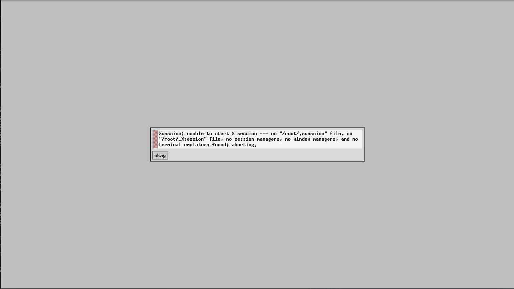
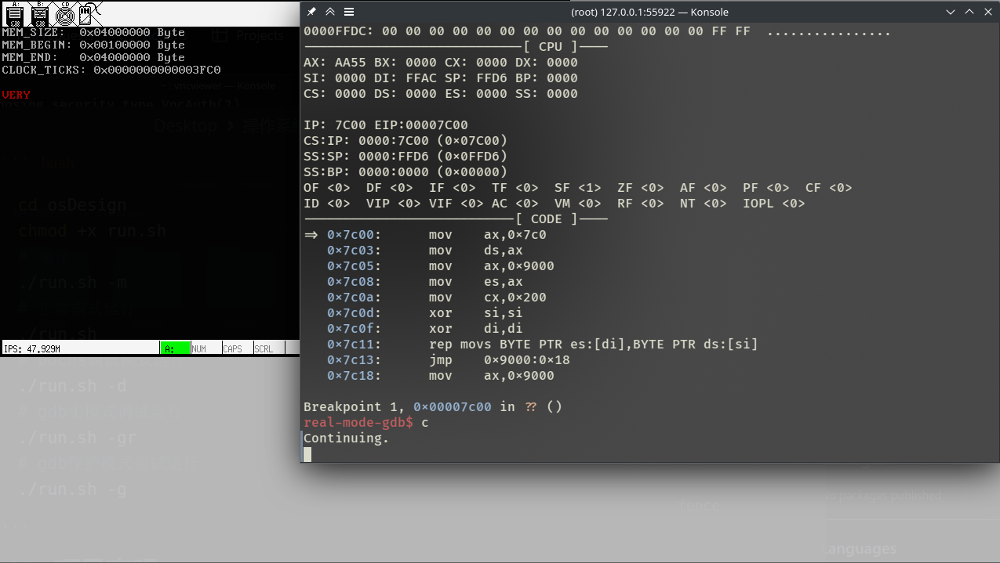

## HUST CSE OS-Design 2024

华中科技大学网络空间安全学院 操作系统课程设计2024

### 0x01 项目介绍

本项目使用NASM汇编、AS汇编以及C语言开发，基于bochs虚拟机实现一个简易的MBR启动内核

### 0x02 项目构建

本项目开发/运行环境使用docker容器搭建，使用docker-compose工具运行

图像界面使用vnc进行连接，命令行界面使用ssh连接，建议使用vscode ssh插件连接容器进行开发

- 克隆本仓库
  
  ```bash
  git clone https://github.com/noxke/osDesign.git
  ```

- 构建docker镜像
  
  ```bash
  cd osDesign/docker
  docker build . -t osDesign:latest
  cd -
  ```

- 运行容器
  
  ```bash
  cd osDesign/docker
  docker-compose up
  ```

- ssh连接容器(user=root, passwd=passwd)
  
  ```bash
  ssh root@127.0.0.1 -p 55922
  ```

- vnc连接图形界面(passwd=passwd)
  
  ```bash
  vncviewer 127.0.0.1:55901
  ```
  
  

- 编译运行项目(ssh连接后)
  
  ```bash
  cd osDesign
  chmod +x run.sh
  # 编译
  ./run.sh -m
  # 正常模式运行
  ./run.sh
  # bochs调试模式运行
  ./run.sh -d
  # gdb实模式调试运行
  ./run.sh -gr
  # gdb保护模式调试运行
  ./run.sh -g
  ```
  
  

### 0x03 项目声明

本项目仅供学习研究使用
